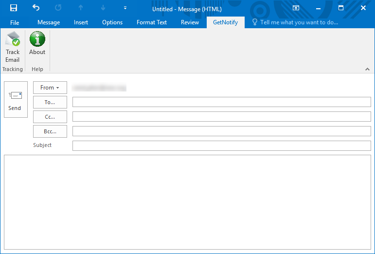

# GetNotify_Outlook_Add-in
A MS Outlook VSTO Add-in to work with GetNotify email tracker service.

Instructions:  
1- Create an account on http://getnotify.com  
2- Download setup.zip and run the setup file.  
3- When composing emails, enable the Track Email option.  
The Add-in will automatically add ".getnotify.com" at the end of all addresses and will take care of existing addresses containing ".getnotify.com".

